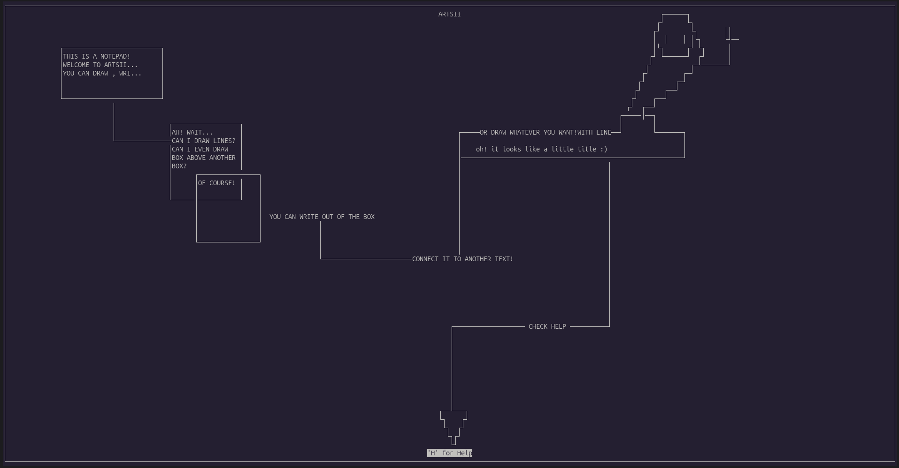

# ARTSII

ARTSII is a terminal-based drawing program written in C using the ncurses library.
It allows users to create simple ASCII graphics directly inside the terminal by moving the cursor 
and drawing shapes such as rectangles, lines, and text. The interface is interactive and controlled entirely through the keyboard,
with support for basic editing actions and an integrated help window.



## Installation

Make sure you have a C compiler and the ncurses library installed on your system.

### Debian / Ubuntu
```bash
sudo apt update
sudo apt install build-essential libncurses5-dev libncursesw5-dev
```

### MacOs (Homebrew)
```
brew install ncurses
```

### Arch based distros
```
sudo pacman -S base-devel ncurses
```

## Compile 
```
gcc artsii.c -o artsii -lncurses
```

## Run 
```
./artsii
```
